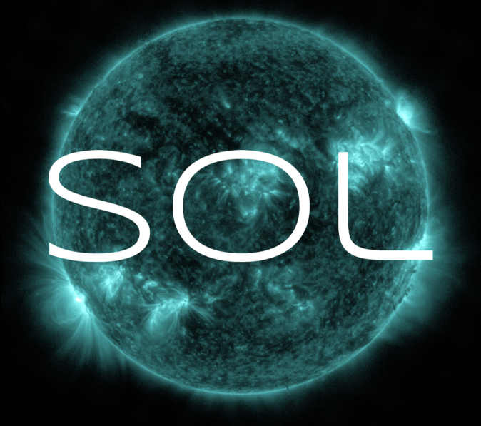

# sol
Stunning images and information about our closest star.

An iOS application to view and interact with images from [NASA's](https://www.nasa.gov) (Solar Dynamic Observatory)[https://sdo.gsfc.nasa.gov],
and display current space weather alerts and forecast information from [NOAA's](https://www.noaa.gov) [Space Weather Prediction Center](https://www.swpc.noaa.gov).

[@levigroker](https://github.com/levigroker)
2022-09-20